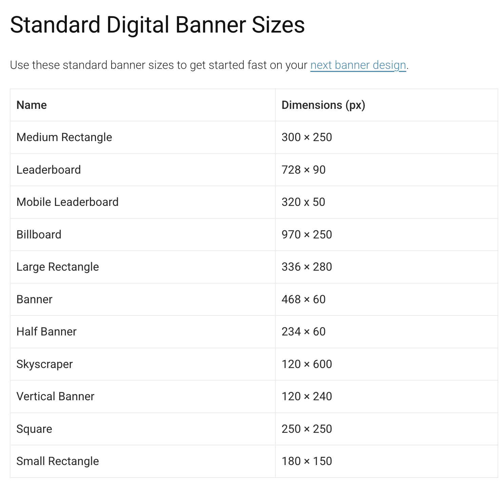

# 📈 Portfolio Marketing Plan - Taylor'D

## Overview

This document outlines a marketing plan aimed to promote **Taylor'D** and become the Top productivity tool and build brand awareness. Built with developers and planners in mind.

---

### **📦 What is Taylor'D?**

_Code. Design. Perfectly Taylor'D._ portfolio project can be seen as a more digital alternative to writing a cover letter or resume. **Taylor'D** is built using Next.JS with a clean UI from the help of HeroUI and TailwindCSS and data coming in from Sanity CMS. This portfolio will display my skills, achievements, education, and projects.

---

### **🎯 Target Audience: Why and Who?**

- Tech recruiters or hiring managers
- Startups looking for web/dev skills
- **Developers**: Tool to manage task and projects
- **Teachers**: Flexible monthly planner
- **Technology Teams**: Alternative to Notes or Reminders

---

### **🧳 Portfolio Checklist**

- [x] Markdown Template
- [] Mobile friendly and accessible
- [x] Identify target audience
- [] Contact form & Social links
- [] CLear CTA - Connect, Hire Me
- Employer?
- [x]Paragraph describing product

---

### **✍🏽 Content Strategy**

**Blog / Case Study Ideas**

- 'How I built Taylor'D using Next.js and Sanity'
- 'No longer NextUI...new and improved HeroUI'
- 'Implement NextAuth'
- Case Studies?

**Distribution Platforms**

- Medium / GeeksForGeeks
- LinkedIn Articles
- Personal Blog
- Instagram
- YouTube

 

---

### **📈 Analytics**

**Metrics to track**:

- GitHub stars and forks
- Traffic

---

### **🚦 Drive Traffic**

**🛜 Domain Registration**

**Platform: Hostinger**

- Cost: $2.69 /month

- FREE domain, email, and website backups

**Platform: Wix**

- Cost: FREE SSL Certificate
- Advanced security measuring

**Platform: IONOS**

- Cost: Free domain & SSL Certificate
- FREE shipping

**Flyer's**

- Canva Infographic
- Gather feedback - customer satisfaction survey or leave a review?
- Pop-up contact and ask for contact information
- QR Code Marketing
  - [qrcode monkey 100% FREE](https://www.qrcode-monkey.com/)
  - [QR Code Generator](https://www.qr-code-generator.com/)
  - Direct to landing page?
- Color Scheme

**Posting Schedule(Instagram/LinkedIn)**:

- 3x per week
- 1x blog post every 3 weeks
- Q/A monthly

 

---

### **🔎 SEO**

- Target audience
  - Purchase
  - How they will use application
- articulate plan to drive traffic to Capstone

 

---

### **💹 Marketing Methods**

- Describe methods to reach target audience
- List marketing methods
  - Ex. Business Card - Digital & Physical
  - Cost
  - Resources
- How methods will work and why

#### **🏢 Conference's**

- **Black is Tech Week 2025**
  - Location: Houston, TX
  - Date: August 11th - 16th, 2025
  - FREE Main/General events
- **Into The Box 2025**
  - Location: Washington, DC
  - Date: April 30th - May 2nd, 2025
  - Cost: $199 - $239
- **JSCONF 2025**
  - Location: New York, New York
  - Date: October 14th - 16th, 2025
  - Online

#### **📱 Social Media**

**Instagram**:

- **Reels / Content Ideas**
  - 'Next.Js vs. Express.Js'
  - 'JavaScript cheat sheet'
  - 'GitHub commands'
  - 'Color Palettes'

**LinkedIn**:

- Professional reach
- 'How i built Taylor'D using Next.js & Sanity'
- Display YouTube link with image

**SnapChat (optional)**

- Influencer promo
- App installs with Snapchat Ads
- Snapchat Ad Formats

#### **📈 Marketing Ads**

- **Meta Ads**
  - Ads Manager - also IG & Messenger
- **Click ads**
  - Pay-per-click(PPC): ONLY pay when a user clicks on their ad
  - Cost-per-pick(CPC): Refer to the amount an advertiser pays for each click
- **Google Ads**

  **Cost for Roanoke-Lynchburg Area:**

  

#### **🤝🏽 Community Engagement**

- Web Developer discussions
- Network with influencer with a strong digital presence
- Discord or Slack gang
- Try my app...not happy? offer reward

#### **📇 Business Card**

- Platform: Canva
- Style: Premium paper, Matte finish, and Square Corners
- Cost: 100 cards / $22 --- 50 cards / $16.50

 

---

### 🔗 Reference Links

**Website Planet**

[25 Best Marketing Portfolio Examples to Inspire You in 2025](https://www.websiteplanet.com/blog/best-marketing-portfolio-examples/): Great portfolio examples to reference or draw inspiration from.

**Forbes Advisor**

[Best Web Hosting Services of April 2025](https://www.forbes.com/advisor/l/best-web-hosting-services/?utm_content=165880225807&utm_term=kwd-10020181&utm_campaign=21283872658&utm_source=google&utm_medium=cpc&accountid=5243522780&utm_content=165880225807&utm_term=kwd-10020181&utm_campaign=21283872658&network=g&device=c&placement=&location_physical=9008741&device_model=&creative=728159286918&gad_source=1&gclid=CjwKCAjw--K_BhB5EiwAuwYoysvBcizs08ESYiMh6XGb0nImj2A6imiyx7QvTNDKsnLDNmDJg4cTWBoCHekQAvD_BwE)

**Bluehost**

[How to Grow your business with QR Code marketing](https://www.bluehost.com/blog/qr-code-marketing/?utm_campaign=dsa_blog_PPC&utm_source=googleads&utm_medium=genericsearch&channelid=P61C101S570N0B5578A2D4499E0000V113&gad_source=1&gclid=CjwKCAjw--K_BhB5EiwAuwYoyma1PjIdtKvg8spediV7DahEORsm8KfZ7FX3O2KE7VvV4xd28ortaBoCFgsQAvD_BwE&gclsrc=aw.ds)

**SnapChat Business**

[How to get more app install with SnapChat Ads](https://forbusiness.snapchat.com/advertising/industry/app?_sid=PAID&utm_campaign=US_G_Search_Brand_MKAG-howtocreateads&utm_content=startsnapchatads&utm_medium=PAIDB2B&utm_source=GoogleSEM&utm_term=US&gclid=CjwKCAjw--K_BhB5EiwAuwYoyiFUREEZWXdQVHsnlndjfxpArHA0PUqmSyP1g9YXamGXbrIsTSwDPBoCQ7cQAvD_BwE)

[Drive Results with Snap's Immersive Ad Formats](https://forbusiness.snapchat.com/advertising/ad-formats?_sid=PAID&utm_campaign=US_G_Search_Brand_MKAG-howtocreateads&utm_content=startsnapchatads&utm_medium=PAIDB2B&utm_source=GoogleSEM&utm_term=US&gclid=CjwKCAjw--K_BhB5EiwAuwYoyiFUREEZWXdQVHsnlndjfxpArHA0PUqmSyP1g9YXamGXbrIsTSwDPBoCQ7cQAvD_BwE): Grow your business with Snapchat Ads

**Facebook Ad Manager**

[Ad Manager](https://en-gb.facebook.com/business/tools/ads-manager): manage ads for Instagram, Facebook, and Messenger

**Google AI**

[Click Ad's](https://docs.google.com/document/d/e/2PACX-1vQuYu0KzaIVn-Q4GuqvuPShML0RpfKV8J32y07Z53AXJwaVsNw3zRfsCPaDWYHm40OuiVSyWWoMOPhB/pub): Clicks Ad's (PPC or CPC)

**Google Business**

[YouTube Ads](https://business.google.com/us/ad-solutions/youtube-ads/?subid=us-en-ha-yt-bk-c-000!o3~CjwKCAjw--K_BhB5EiwAuwYoyh4y43nAcozFsKlFgECP-O2dAeuXvKOOcrftRkd3KAVPMTcRUgllOhoCLWkQAvD_BwE~163778712681~kwd-7683981707~21118381113~694820235790&gad_source=1&gclid=CjwKCAjw--K_BhB5EiwAuwYoyh4y43nAcozFsKlFgECP-O2dAeuXvKOOcrftRkd3KAVPMTcRUgllOhoCLWkQAvD_BwE&gclsrc=aw.ds): Drive the results you care about with YouTube Ads

 
